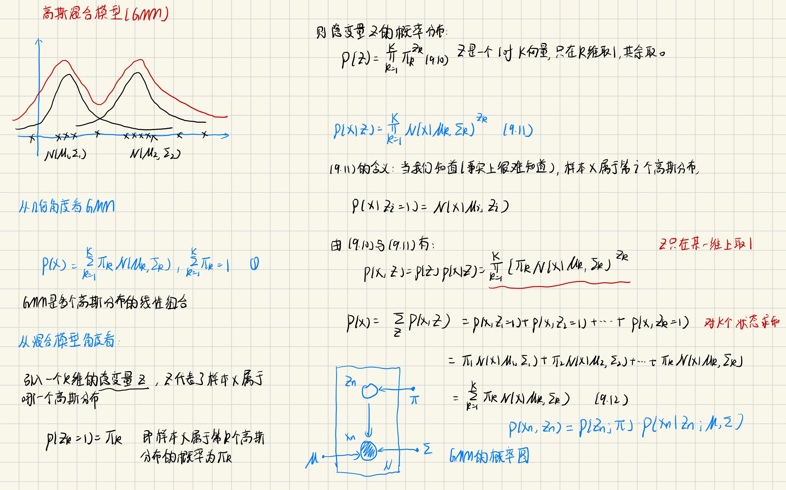
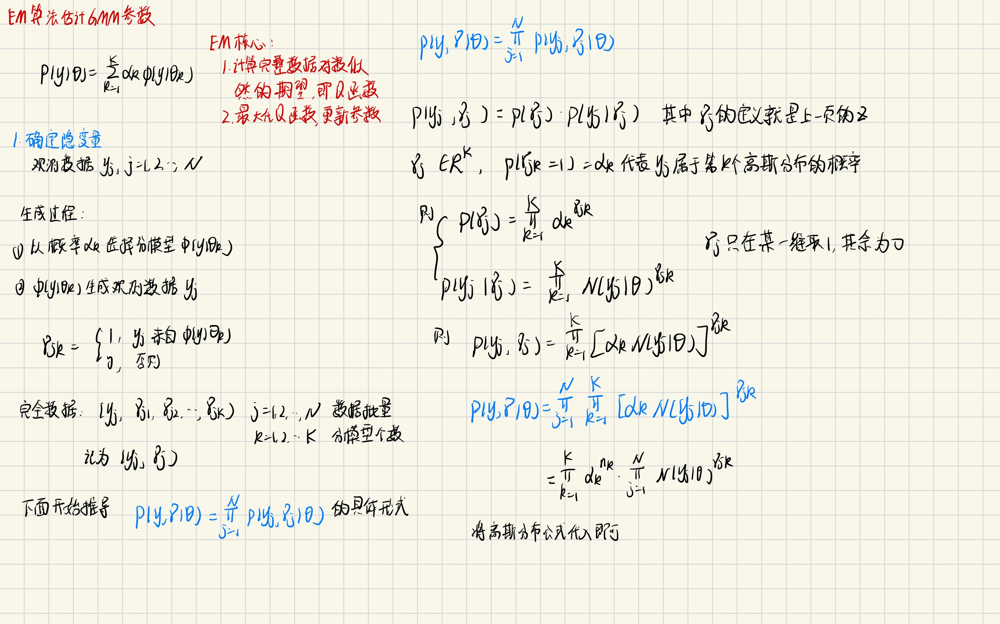
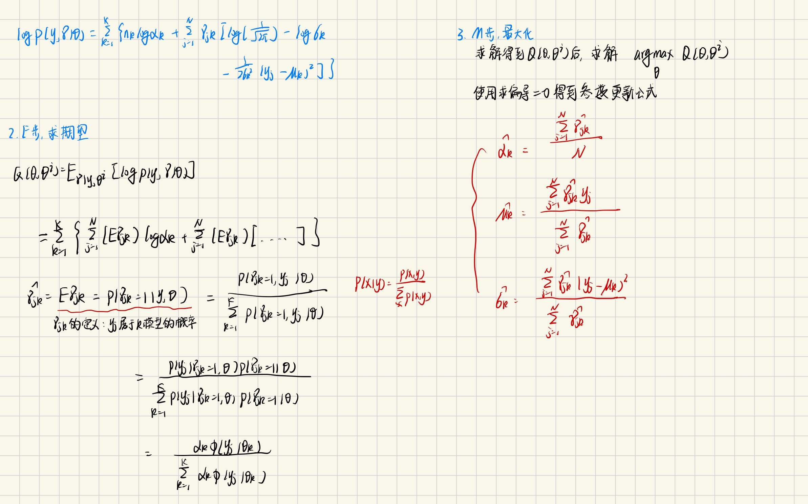
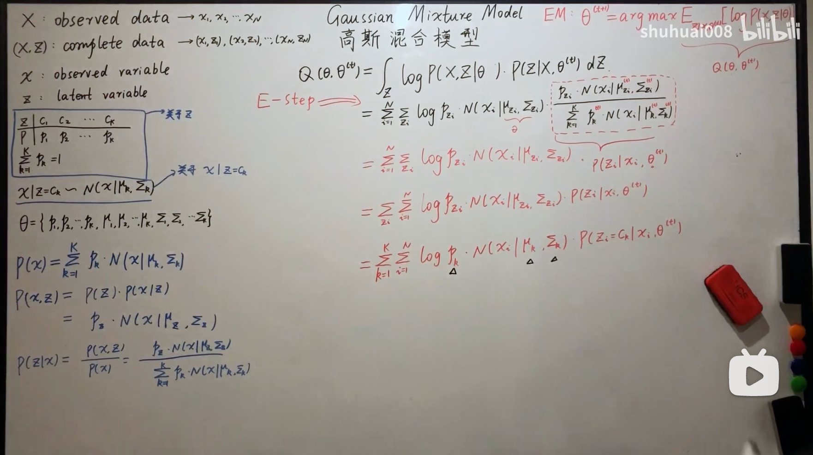

# 高斯混合模型与EM算法
## 1. 高斯混合模型的定义
高斯混合模型是指具有如下形式的概率分布模型:
$$
P(y | \theta) = \sum_{k=1}^K \alpha_k \phi(y|\theta_k)
$$
其中, $\alpha_k$是系数, 满足$\alpha_k >= 0 ;\sum_{k=1}^K \alpha_k= 1$

$$
\phi(y|\theta_k) = \frac{1}{\sqrt{2\pi} \sigma_k} exp(-\frac{(y-\mu_k)^2}{2\sigma_k^2})
$$

可以从两个角度理解高斯混合模型
1. 几何角度     
    GMM是多个高斯分布的线性组合
2. 混合模型角度     
    引入一个k维的隐变量$z$, $z$代表样本$x$属于某个高斯分布的概率，$p(z_k = 1) = \alpha_k$



## 2. GMM参数的EM算法估计
EM算法的核心:   
1. 求完整数据的期望, 即Q函数;
2. 最大化Q函数, 使用求偏导为0的方法迭代更新参数

---
- 确定隐变量

这里的关键是隐变量的确定, $\gamma_{jk}$的含义是$y_j$属于第k个分模型的概率, 即 $p(\gamma_{jk} = 1 | \theta) = \alpha_k$, $p(y_j | \gamma_{jk} =1, \theta) = N(y_j; \mu,\sigma)$

---
- EM算法求解GMM

说实话, 这里的E步求完整数据的期望我并没有搞懂, 所以只能依葫芦画瓢把结论抄下来了

个人觉得shuhuai大佬的推导比《统计学习方法》上的推导清楚
$$
Q(\theta, \theta^{(t)}) = \sum_z log P(X,Z | \theta) P(Z|X, \theta^{(t)})
$$
根据定义把这里面的概率表达式一个一个写出来就好了


## 代码
[GMM code](./gmm.py)
1. 初始化参数   
```python
class GMM:
    def _init_param(self, X):
        N, d = X.shape
        C = self.hyperparameters["C"]

        rr = np.random.rand(C)

        self.parameters = {
            "pi": rr / rr.sum(),  # cluster priors
            "Q": np.zeros((N, C)),  # variational distribution q(T)
            "mu": np.random.uniform(-5, 10, C * d).reshape(C, d),  # cluster means
            "sigma": np.array([np.eye(d) for _ in range(C)]),  # cluster covariances
        }
```
- C: 高斯分布的个数, 是需要自己指定的超参
- pi: [K, ], 即$\alpha_k$, 需要在训练的过程中检查是否满足概率约束条件
- mu: [K, d], 高斯分布的均值
- simga: [K, d, d], 高斯分布的方差

2. E步, 求模型对数据的响应度    
这步主要计算
$$
\hat \gamma_{jk} = \frac{\alpha_k \phi(y_j|\theta_k)}{\sum_{k=1}^K \alpha_k \phi(y_j|\theta_k)}
$$
```python
def _E_step(self, X):
    P = self.parameters
    C = self.hyperparameters["C"]
    pi, Q, mu, sigma = P["pi"], P["Q"], P["mu"], P["sigma"]

    for i, x_i in enumerate(X):
        denom_vals = []
        for c in range(C):
            pi_c = pi[c]
            mu_c = mu[c, :]
            sigma_c = sigma[c, :, :]

            log_pi_c = np.log(pi_c)
            log_p_x_i = log_gaussian_pdf(x_i, mu_c, sigma_c)

            # log N(X_i | mu_c, Sigma_c) + log pi_c
            denom_vals.append(log_p_x_i + log_pi_c)

        # log \sum_c exp{ log N(X_i | mu_c, Sigma_c) + log pi_c } ]
        log_denom = logsumexp(denom_vals)
        q_i = np.exp([num - log_denom for num in denom_vals])
        np.testing.assert_allclose(np.sum(q_i), 1, err_msg="{}".format(np.sum(q_i)))

        Q[i, :] = q_i
```
代码计算了
$$
log \hat \gamma_{jk} = log \alpha_k + log \phi(y_j | \theta_k) - \sum_{k=1}^K \{ log \alpha_k + log \phi(y_j | \theta_k) \}
$$
并且对于后一项的求和使用`logexpsum`的技巧

3. M步, 求解迭代参数
```python
def _M_step(self, X):
    N, d = X.shape
    P = self.parameters
    C = self.hyperparameters["C"]
    pi, Q, mu, sigma = P["pi"], P["Q"], P["mu"], P["sigma"]

    denoms = np.sum(Q, axis=0)

    # update cluster priors
    pi = denoms / N

    # update cluster means
    nums_mu = [np.dot(Q[:, c], X) for c in range(C)]
    for ix, (num, den) in enumerate(zip(nums_mu, denoms)):
        mu[ix, :] = num / den if den > 0 else np.zeros_like(num)

    # update cluster covariances
    for c in range(C):
        mu_c = mu[c, :]
        n_c = denoms[c]

        outer = np.zeros((d, d))
        for i in range(N):
            wic = Q[i, c]
            xi = X[i, :]
            outer += wic * np.outer(xi - mu_c, xi - mu_c)

        outer = outer / n_c if n_c > 0 else outer
        sigma[c, :, :] = outer

    np.testing.assert_allclose(np.sum(pi), 1, err_msg="{}".format(np.sum(pi)))
```

## 参考资料
- 《统计学习方法第二版》
- [白板机器学习](https://www.bilibili.com/video/BV1aE411o7qd?vd_source=30b83821f97341a4ef89241dcf18da58&spm_id_from=333.788.player.switch&p=69)
- [numpy-ml](https://github.com/ddbourgin/numpy-ml/tree/master/numpy_ml/gmm)

