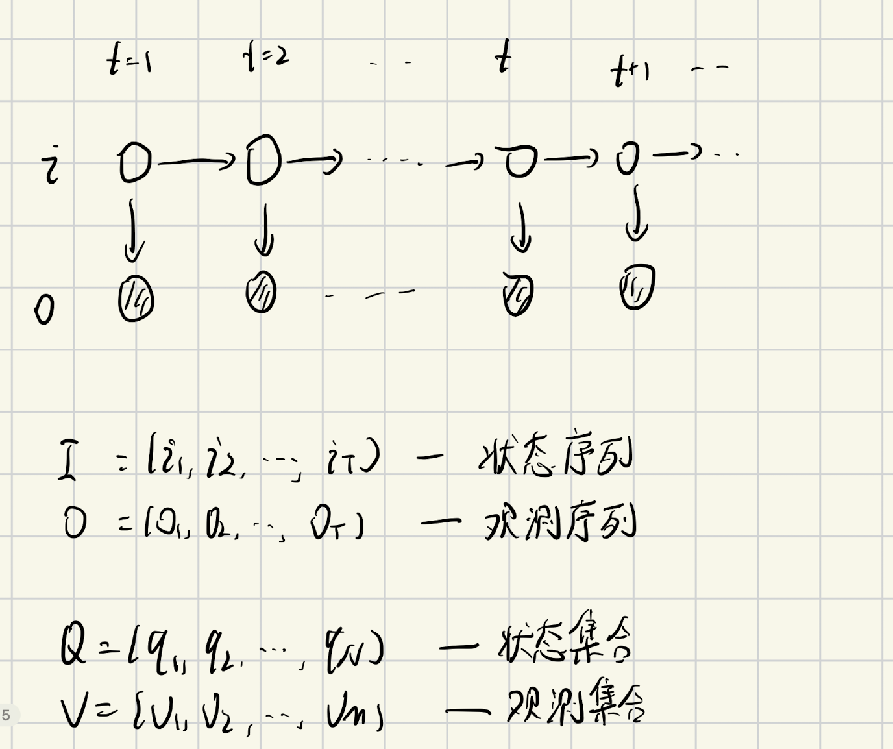

# 隐马尔科夫模型(HMM)
## 模型定义
隐马尔可夫模型由初始概率分布、状态转移概率分布以及观测概率分布确定   


$$
Q = \{q_1, q_2, \dots, q_N\}, V = \{v_1, v_2, \dots, v_M\} \\
I = (i_1, i_2, \dots, i_T), O = (o_1, o_2, \dots, o_T)
$$
- $Q$: 所有可能的状态集合
- $V$: 所有可能的观测集合
- $I$: 状态序列
- $O$: 观测序列

隐马尔可夫模型由初始状态概率向量$\pi$、状态转移概率矩阵$A$和观测概率矩阵$B$决定, $\lambda = (A,B, \pi)$
$$
\begin{aligned}
A &= [a_{ij}]_{N \times N}, & a_{ij} &= P(i_{t+1} = q_j | i_t = q_i) \\
B &= [b_j(k)]_{N \times M}, & b_j(k) &= P(o_t = v_k | i_t = q_j)    \\
\pi &= (\pi_i), & \pi_i &= P(i_1 = q_i)
\end{aligned}
$$

其中隐含的约束条件为:   
$$
\sum_{j=1}^{N} a_{ij} = 1   \\
\sum_{k=1}^M b_j(k) = 1 \\
\sum_{i=1}^N \pi_i = 1
$$

**HMM的两个基本假设**   
以下两个假设可以从HMM的概率图中很明显的观察得到
1. 齐次马尔科夫性假设
    $$
    P(i_t | i_{t-1}, o_{t-1}, \dots, i_1, o_1) = P(i_t | i_{t-1})
    $$

2. 观测独立性假设
    $$
    p(o_t | i_T, o_T, i_{T-1}, o_{T-1}, \dots, i_1, o_1) = P(o_t | i_t)
    $$

**HMM的初始化代码**
```python
class HMM:
    def __init__(self, A=None, B=None, pi=None, eps=None):
        eps = np.finfo(float).eps if eps is None else eps

        if pi is not None:
            pi[pi == 0] = eps

        N = None
        if A is not None:
            N = A.shape[0]
            A[A == 0] = eps

        M = None
        if B is not None:
            M = B.shape[1]
            B[B == 0] = eps

        self.hyper_param = {
            "eps": eps,
        }
        self.param = {
            "A": A,
            "B": B,
            "pi": pi,
        }
        self.N = N
        self.M = M

    def _init_param(self):
        param = self.param
        A, B, pi = param["A"], param["B"], param["pi"]

        # 初识时, 每个隐状态的概率都是均等的
        if pi is None:
            pi = np.ones(self.N)
            pi = pi / np.sum(pi)

        # 初始化时, 隐状态之间的转移概率是均等的
        if A is None:
            A = np.ones((self.N, self.N))   # A的列向量是概率和, 应该为1
            A = A / np.sum(A, axis=1)[:, None]

        if B is None:
            B = np.random.randn(self.N, self.M)
            B = B / np.sum(B, axis=1)[:, None]

        param["A"], param["B"], param["pi"] = A, B, pi
```

---

## HMM的三个基本问题    
1. 概率计算问题     
    给定模型$\lambda$和观测序列$O$, 计算观测序列$O$出现的概率$P(O;\lambda)$
2. 学习问题     
    给定观测序列$O$, 估计模型的参数$\lambda$, 使得在该模型下观测序列概率$P(O|\lambda)$最大
3. 预测问题     
    也称为解码问题。已知模型$\lambda$和观察序列$O$, 求最可能对应的状态序列$P(I|O)$

## $P(O|\lambda)的计算法$
1. 直接计算法
    $$
    \begin{aligned}
    P(O; \lambda) &= \sum_I P(O|I;\lambda)P(I;\lambda)   \\
                  &= \sum_{i_1,i_2,\dots,i_t} \pi_{i_1}, b_{i_1}(o_1)a_{i_1i_2}b_{i_2}(o_2)\dots a_{i_{T-1}i_T}b_{i_T}(o_T)
    \end{aligned}
    $$

    计算复杂度$O(TN^T)$, 计算量太大不可行

2. 前向算法     
    记 $\alpha_t(i) = P(o_1, o_2, \dots, o_t,i_t=q_i | \lambda)$
    
    $$
    \begin{aligned}
        \alpha_1(i) &= \pi_i b_i(o_1) \\
        \alpha_{t+1}(i) &= [\sum_{j=1}^n \alpha_t(j) a_{ji}] b_i(o_{t+1})   \\
        P(O;\lambda) &= \sum_{i=1}^T \alpha_T(i)

    \end{aligned}
    $$

    ```python
    A = np.array([[0.5, 0.2, 0.3], [0.3, 0.5, 0.2], [0.2, 0.3, 0.5]])
    B = np.array([[0.5, 0.5], [0.4, 0.6], [0.7, 0.3]])
    pi = np.array([0.2, 0.4, 0.4])

    O = np.array([0, 1, 0])

    T = 3
    N = A.shape[0]
    M = B.shape[1]

    alpha = np.zeros((T, N))
    # 1. 计算初值
    for i in range(N):
        alpha[0, i] = pi[i] * B[i, O[0]]

    # 2. 递推
    for t in range(1, T):
        for i in range(N):
            tmp = 0.0
            for j in range(N):
                tmp += alpha[t-1, j] * A[j, i]

            alpha[t, i] = tmp * B[i, O[t]]
    ```

    写成矩阵的形式:
    ```python
    # 1. 初始化
    alpha[0, :] = pi * B[:, O[0]]

    # 2. 递推
    for t in range(1, T):
        alpha[t, :] = (alpha[t-1, :] @ A) * B[:, O[t]]

    res = np.sum(alpha[-1, :])
    ```

2. 后向算法
    记 $\beta_t(i)  = P(o_{t+1}, o_{t+2}, \dots, o_T | i_t = q_i; \lambda)$

    $$
    \begin{aligned}
        \beta_T(i) &= 1 \\
        \beta_t(i) &= \sum_{j=1}^N a_{ij} b_j(o_{t+1}) \beta_{t+1}(j) \\

        P(O|\lambda) &= \sum_{i=1}^N \pi_i b_i(o_1) \beta_1(i)

    \end{aligned}
    $$

    ```python
    beta = np.zeros((T, N))

    beta[T-1, :] = 1.0
    for t in range(T-2, -1, -1):
        for i in range(N):
            tmp = 0.0
            for j in range(N):
                tmp += A[i, j] * B[j, O[t+1]] * beta[t+1, j]

            beta[t, i] = tmp

    res = 0.0
    for i in range(N):
        res += pi[i] * B[i, O[0]] * beta[0, i]
    ```

    写成矩阵形式:
    ```python
    beta = np.zeros((T, N))

    beta[T-1, :] = 1.0
    for t in range(T-2, -1, -1):
        beta[t, :] = (A * B[:, O[t+1]]) @ beta[t+1, :]

    res = np.sum(pi * B[:, O[0]] * beta[0, :])
    ```

## 一些概率与期望值的计算
1. 给定模型$\lambda$和观测$O$, 计算在时刻$t$处于状态$q_i$的概率
    $$
        \begin{aligned}
        \gamma_t(i) &= P(i_t = q_i | O; \lambda) \\
                    &= \frac{\alpha_t(i) \beta_t(i)}{\sum_{j=1}^n \alpha_t(j) \beta_t(j)}
        \end{aligned}
    $$

2. 给定模型$\lambda$和观测$O$, 计算在时刻$t$处于状态$q_i$且在$t+1$时刻处于状态$q_j$的概率
    $$
        \begin{aligned}
        \epsilon_t(i,j) &= P(i_t=q_i, i_{t+1} = q_j | O; \lambda) \\
        &= \frac{\alpha_t(i) a_{ij} b_j(o_{t+1}) \beta_{t+1}(j)}{\sum\limits_{i=1}^{N} \sum\limits_{j=1}^{N} \alpha_t(i) a_{ij} b_j(o_{t+1}) \beta_{t+1}(j)}
        \end{aligned}
    $$

## 学习算法
**Baum-Welch 算法**
1. E步: 求Q函数
    $$
    Q(\lambda, \hat \lambda) = \sum_I log P(O,I;\lambda)P(O,I;\hat \lambda) 
    $$

2. M步: 极大化Q函数
    $$
    \begin{aligned}
    a_{ij} &= \frac{\sum_{t=1}}{T-1} \epsilon_t(i,j) \\
    b_j(k) &= \frac{\sum_{t=1,o_t=v_k}^T \gamma_t(j)}{\sum_{t=1}^T \gamma_t(j)} \\
    \pi_i &= \gamma_(i)
    \end{aligned}
    $$