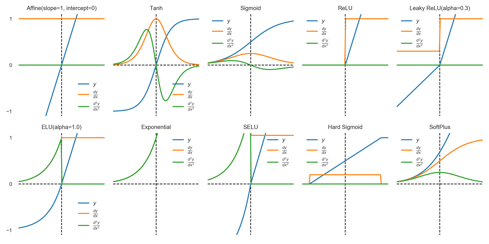

# Activation Functions
The `activations` module implements several common activation functions:

- Rectified linear units (ReLU) ([Hahnloser et al., 2000](https://arxiv.org/pdf/1803.08375))
- Leaky rectified linear units
  ([Maas, Hannun, & Ng, 2013](https://ai.stanford.edu/~amaas/papers/relu_hybrid_icml2013_final.pdf))
- Exponential linear units ([Clevert, Unterthiner, & Hochreiter, 2016](https://arxiv.org/pdf/1511.07289.pdf))
- Scaled exponential linear units ([Klambauer, Unterthiner, & Mayr, 2017](https://arxiv.org/pdf/1706.02515.pdf))
- Softplus units
- Hard sigmoid units
- Exponential units
- Hyperbolic tangent (tanh)
- Logistic sigmoid
- Affine

## Plots

## GELU
[GAUSSIAN ERROR LINEAR UNITS (GELUS)](https://arxiv.org/pdf/1606.08415)

**计算公式**
$$
GELU(x) = x · \Phi(x) = 0.5x * (1+erf(x/\sqrt(2)))
$$

近似计算
$$
FastGELU(x) = x *sigmoid(1.702x)  \\
GELU(x) = 0.5x * (1+tanh(\sqrt\frac{2}{\pi}(x+0.044715x^3)))
$$

**梯度计算公式**
$$
\frac{\partial \text{GELU}}{\partial x_i}  =
                \frac{1}{2} + \frac{1}{2}\left(\text{erf}(\frac{x}{\sqrt{2}}) +
                    \frac{x + \text{erf}'(\frac{x}{\sqrt{2}})}{\sqrt{2}}\right) \\
\text{erf}'(x) = \frac{2}{\sqrt{\pi}} \cdot \exp\{-x^2\}
$$

**优点**
1. 平滑性与梯度稳定性
- GELU 通过概率积分函数（高斯分布的累积分布函数）实现平滑的非线性变换，避免了 ReLU 在 0 点的硬转折问题，缓解了梯度消失或神经元 “死亡” 现象。
- 梯度在负数区域仍保持非零，更有利于反向传播优化。

2. 适应性更强
- 根据输入的概率分布动态调整输出，对噪声或异常值更鲁棒。
- 输出分布更接近正态分布，可能更适合后续的线性层计算。

3. 性能优势
- 在自然语言处理（如 BERT、GPT）、图像识别等任务中表现优异，通常优于 ReLU 及其变种（如 LeakyReLU、Swish）。

**缺点**
1. 计算复杂度高
- GELU 涉及指数函数和误差函数（erf）的计算，对硬件和计算资源要求较高，推理速度可能较慢。
- 某些框架（如早期 TensorFlow）需手动实现或依赖近似优化。

2. 潜在过拟合风险
- 平滑性可能导致模型在训练时更倾向于记忆噪声，需结合正则化（如 Dropout）使用。

3. 非单调特性
- 函数在部分区域可能出现局部最小值，理论上可能影响优化过程，但实际应用中影响较小。

**适用场景**
- 自然语言处理任务（如 Transformer 模型）：GELU 已成为主流选择，显著提升模型效果。
- 复杂视觉任务：在需要高非线性表达能力的场景中表现出色。
- 硬件支持良好的环境：若使用 GPU 或 TPU 加速，计算成本问题可被缓解。

## ELU
ELU（Exponential Linear Unit，指数线性单元）是 2015 年提出的 ReLU 改进型激活函数，通过负区间的指数平滑解决 ReLU 的 “神经元死亡” 问题，同时保留正向线性特性.

**计算公式**
$$
ELU(x) = \alpha (e^x - 1)  \quad if \quad x < 0
$$

**核心改进**
1. 负区间非零梯度: $x<0$时梯度为$\alpha e^x$(接近 0 但非零)，避免神经元死亡
2. 输出均值趋近于零：负区间的饱和特性使激活输出更接近零均值，缓解内部协变量偏移
3. 平滑过渡：在x=0处连续可导（梯度为 1），避免 ReLU 的硬拐点

**调参建议**
1. $\alpha$的选择
	- 固定$\alpha=1$
	- 可学习$\alpha$
2. 与归一层的配合
	- 搭配BN层时, $\alpha$可以适当调小
	- 单独使用时, 优先选择SELU
3. 初始化
	- 使用He初始化
	- SELU必须搭配lecun_normal初始化

## HardSigmoid
HardSigmoid 是 Sigmoid 函数的分段线性近似，通过移除指数运算大幅降低计算成本，适合移动端 / 嵌入式设备
$$
HardSigmoid(x) = 
	\begin{cases}
		0 & \text{if } x \leq -2.5 \\
		0.2x + 0.5 & \text{if } -2.5 < x < 2.5 \\
		1 & \text{if } x \geq 2.5 
	\end{cases}
$$

## SoftPlus
SoftPlus 是深度学习中经典的平滑激活函数，设计目标是解决 ReLU 的 “硬拐点” 问题，同时保持单侧抑制特性
$$
SoftPlus(x) = ln(1 + e^x)
$$