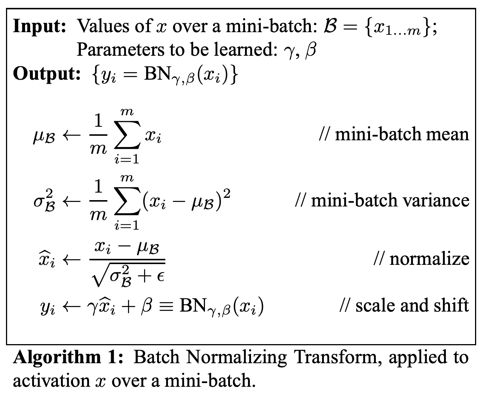
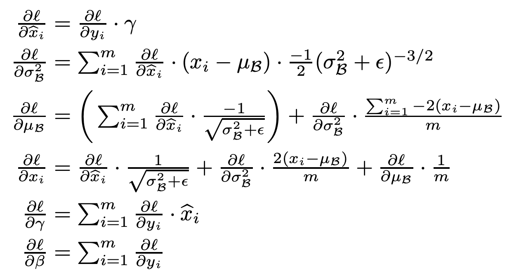

# Layers
The `layers.py` module implements common layers / layer-wise operations that can
be composed to create larger neural networks. It includes:

- Fully-connected layers
- Sparse evolutionary layers ([Mocanu et al., 2018](https://www.nature.com/articles/s41467-018-04316-3))
- Dot-product attention layers ([Luong, Pho, & Manning, 2015](https://arxiv.org/pdf/1508.04025.pdf); [Vaswani et al., 2017](https://arxiv.org/pdf/1706.03762.pdf))
- 1D and 2D convolution (with stride, padding, and dilation) layers ([van den Oord et al., 2016](https://arxiv.org/pdf/1609.03499.pdf); [Yu & Kolton, 2016](https://arxiv.org/pdf/1511.07122.pdf))
- 2D "deconvolution" (with stride and padding) layers ([Zeiler et al., 2010](https://www.matthewzeiler.com/mattzeiler/deconvolutionalnetworks.pdf))
- Restricted Boltzmann machines (with CD-_n_ training) ([Smolensky, 1996](http://stanford.edu/~jlmcc/papers/PDP/Volume%201/Chap6_PDP86.pdf); [Carreira-Perpiñán & Hinton, 2005](http://www.cs.toronto.edu/~fritz/absps/cdmiguel.pdf))
- Elementwise multiplication operation
- Summation operation
- Flattening operation
- Embedding layer
- Softmax layer
- Max & average pooling layer
- 1D and 2D batch normalization layers ([Ioffe & Szegedy, 2015](http://proceedings.mlr.press/v37/ioffe15.pdf))
- 1D and 2D layer normalization layers ([Ba, Kiros, & Hinton, 2016](https://arxiv.org/pdf/1607.06450.pdf))
- Recurrent layers ([Elman, 1990](https://crl.ucsd.edu/~elman/Papers/fsit.pdf))
- Long short-term memory (LSTM) layers ([Hochreiter & Schmidhuber, 1997](http://www.bioinf.jku.at/publications/older/2604.pdf))

# Batch Normalization
[原文](https://arxiv.org/pdf/1502.03167)    
**概念**    
当神经网络的参数在训练过程中更新时，网络中每层的输入分布会不断变化，导致训练不稳定、训练速度慢。

这个现象称为**Internal Covariate Shift**。

**作者的目标：**
通过在网络的每一层对输入进行标准化（均值为 0、方差为 1），让每一层接收到的数据分布更稳定，从而提高训练速度和收敛性。

**公式**
- input: (N, H, W, C)
- output: (N, H, W, C)

$$
y = \frac{x-E[x]}{\sqrt{Var[x]+\epsilon}} * \gamma + \beta
$$



**参数初始化代码**

```python
def _init_params(self):
    # self.in_ch = C
    scaler = np.random.rand(self.in_ch) # \gamma
    intercept = np.zeros(self.in_ch)    # \beta

    running_mean = np.zeros(self.in_ch)
    running_var = np.ones(self.in_ch)

    self.parameters = {
        "scaler": scaler,
        "intercept": intercept,
        "running_var": running_var,
        "running_mean": running_mean,
    }

    self.gradients = {
        "scaler": np.zeros_like(scaler),    # \gamma梯度的累积
        "intercept": np.zeros_like(intercept),  # \beta梯度的累积
    }

    self.is_initialized = True
```

**前向传播代码**
```python
def forward(self, X, retain_derived=True):
    # input.shape: [B, H, W, C]
    if not self.is_initialized:
        self.in_ch = self.out_ch = X.shape[3]
        self._init_params()

    ep = self.hyperparameters["epsilon"]
    mm = self.hyperparameters["momentum"]
    rm = self.parameters["running_mean"]
    rv = self.parameters["running_var"]

    scaler = self.parameters["scaler"]
    intercept = self.parameters["intercept"]

    X_mean = self.parameters["running_mean"]
    X_var = self.parameters["running_var"]

    if self.trainable and retain_derived:
        # 使用移动平均法计算均值和方差
        X_mean, X_var = X.mean(axis=(0, 1, 2)), X.var(axis=(0, 1, 2))  # , ddof=1)
        self.parameters["running_mean"] = mm * rm + (1.0 - mm) * X_mean
        self.parameters["running_var"] = mm * rv + (1.0 - mm) * X_var

    if retain_derived:
        self.X.append(X)

    N = (X - X_mean) / np.sqrt(X_var + ep)
    y = scaler * N + intercept
    return y
```


**反向传播代码**
```python
def backward(self, dLdy, retain_grads=True):
    assert self.trainable, "Layer is frozen"
    if not isinstance(dLdy, list):
        dLdy = [dLdy]

    dX = []
    X = self.X
    for dy, x in zip(dLdy, X):
        dx, dScaler, dIntercept = self._bwd(dy, x)  # 反向传播的核心代码
        dX.append(dx)

        if retain_grads:
            self.gradients["scaler"] += dScaler
            self.gradients["intercept"] += dIntercept

    return dX[0] if len(X) == 1 else dX

def _bwd(self, dLdy, X):
    scaler = self.parameters["scaler"]
    ep = self.hyperparameters["epsilon"]

    # reshape to 2D, retaining channel dim
    X_shape = X.shape
    X = np.reshape(X, (-1, X.shape[3])) # 将X展平, 方便计算
    dLdy = np.reshape(dLdy, (-1, dLdy.shape[3]))

    # apply 1D batchnorm backward pass on reshaped array
    n_ex, in_ch = X.shape
    X_mean, X_var = X.mean(axis=0), X.var(axis=0)  # , ddof=1)

    N = (X - X_mean) / np.sqrt(X_var + ep)
    dIntercept = dLdy.sum(axis=0)   # dl/d \beta
    dScaler = np.sum(dLdy * N, axis=0)  # dl / d\gamma

    dN = dLdy * scaler
    dX = (n_ex * dN - dN.sum(axis=0) - N * (dN * N).sum(axis=0)) / (
        n_ex * np.sqrt(X_var + ep)
    )

    return np.reshape(dX, X_shape), dScaler, dIntercept
```

# LayerNorm
[Transformer中的归一化(五)：Layer Norm的原理和实现 & 为什么Transformer要用LayerNorm](https://zhuanlan.zhihu.com/p/492803886)    
- BN不适合小batch_size的情况
- BN不适用于RNN这种变长特征的情况

BN是对batch的维度去做归一化，也就是针对不同样本的同一特征做操作。LN是对hidden的维度去做归一化，也就是针对单个样本的不同特征做操作。     
公式方面跟BN大差不差的, 主要是归一化的维度不同因此在具体细节上略有区别